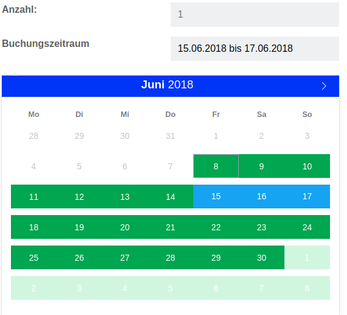

# Contao Isotope Bundle

[](https://packagist.org/packages/heimrichhannot/contao-isotope-bundle)
[](https://packagist.org/packages/heimrichhannot/contao-isotope-bundle)
[](https://travis-ci.org/heimrichhannot/contao-isotope-bundle)
[](https://coveralls.io/github/heimrichhannot/contao-isotope-bundle?branch=master)

This bundle offers additional functionality for the isotope ecommerce system.

## Features

> List not complete

* Stock managment
* Sets
* Booking functionality (book a ressource (product) for specific time)

Also read [Contao Isotope_Plus](https://github.com/heimrichhannot/contao-isotope_plus) Documentation for more information about included features.

## Install 

```php
composer require heimrichhannot/contao-isotope-bundle
```

You need to call the database update tool after install.

If you update from an older version as 0.8 or from isotope_plus module, you need to call the upgrade command (see [Developers](#developers)).

We recommend use [Contao Encore](https://github.com/heimrichhannot/contao-encore-bundle) for assets managment.

## Usage

#### Booking



To add booking functionality to a product, you need to active the booking action in the frontend module for bookable products. 

In the backend, you can add the fields bookingOverview, bookingReservedDates and bookingOverview.

Field | Description
------|-----------
bookingOverview | Days to block around booking date (for shipping, printing, ...)
bookingReservedDates | Reserve date to block booking
bookingOverview | Displays a calendar containing informations about booked items.


## Developers

### Upgrade from older version or module

If you upgrade from [Isotope_Plus](https://github.com/heimrichhannot/contao-isotope_plus) or the bundle prior to version 0.8, you should use the upgrade command to setup the product data table.

```php
# From project folder:
php vendor/bin/contao-console huh:isotope:upgrade
```

This command fills the product data table based on the data stored in product table.

### Commands

For more informations use the help function (`[command] --help`).

Command             | Description | Attributes | Options
--------------------|-------------|------------|--------
huh:isotope:upgrade | Mirrors product data to the product data table | - | overwriteExistingEntries


